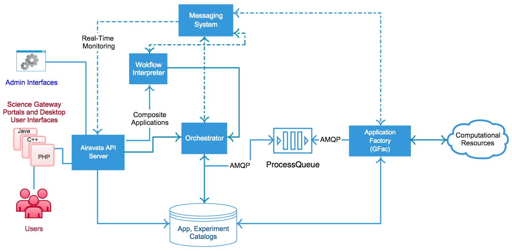

## bioinformatics workflow and pipeline framework

--------

### scripts

Scripts, written in Unix shell or other scripting language such as perl or python could be treated as basic form of pipeline framework. In particular, the robustness feature could be brittle and dependencies refer to upstream and downstream of this pipeline need to be solved manually by authors themselves. Also reentrancy, that the framework recovers from last interrupted point, could be  difficult to implement.

For example: [Redundans](https://github.com/lpryszcz/redundans) is a pipeline that assists an assembly of heterozygous/polymorphic genomes. To run this pipeline, your **OS** needs to satisfy the prerequisites and  by typing the command in terminal the pipeline begins to run until it generates the output or is interrupted by exception.

Recently, as docker container technology becomes more and more popular, so lots of these pipelines could be packaged into images in order to avoid additional installment.  

### make

Make utility is successfully used to manage file transformations common to scientific computing pipelines. It introduces the concept of 'implicit wild card rules', which searches file and dependencies based on file suffixes. However, make itself is not defined for scientific pipelines, as a result, it has several limitations,  such as no built-in support for distributed computing, lacking of powerful data structures as well as impossible sophisticated logic implementation, making it impractical for modern bioinformatics analysis.

------
> Syntax: Implicit ->  Tasks(jobs) should clearly specify the input/output file names or file names wildcards.
> Syntax: Explicit -> Tasks(jobs) depend on other tasks, not file targets.
> Paradigm: Class -> Pipelines are developed and described based on classes inherited.
> Paradigm: Configuration -> Pipelines are developed and described based on configurations.
------

### [Arvados](https://arvados.org/)

[github](https://github.com/curoverse/arvados)

It enables you to quickly begin using cloud computing resources in your data science work and allows you to track your methods and datasets, share them and re-run analysis.

* Syntax: Explicit
* Paradigm: Configuration
* Interaction: CLI
* Distributed Computing Support: Yes, [Curoverse](https://cloud.curoverse.com/) [document](http://doc.arvados.org/user/tutorials/tutorial-workflow-workbench.html) 
* Extensive: [SDK](http://doc.arvados.org/sdk/index.html)
* Language: Python, Go, Ruby
* License: AGPL-3.0 Apache-2.0 CC-BY-SA-3.0 [github](https://github.com/curoverse/arvados/blob/master/COPYING)
* Pros: CWL and YAML are supported, runtime environment is packaged into docker image
* Cons: Compute nodes must have Docker installed to run containers. So root is required.

------

### [Taverna](https://taverna.incubator.apache.org/) 

[apache git](http://git.apache.org/)

Taverna Workbench is a redesign of the Taverna Workbench 1.7.x series from the ground up. In addition to the improvements to the engine, Taverna Workbench provides more support for workflow design with a graphical workflow editor for direct manipulation of the workflow diagram, context-specific views over Web services and other resources, and standard editing facilities such as copy/paste and undo/redo.

* Syntax: Explicit
* Paradigm: Configuration
* Interaction: CLI [Apache Taverna Command-line Tool](https://taverna.incubator.apache.org/download/commandline) & workbench  [Taverna Workbench](https://taverna.incubator.apache.org/download/workbench) 
* Distributed Computing Support:  Yes, [Service Sets](https://taverna.incubator.apache.org/documentation/service-sets/) [(WSDL based)](https://taverna.incubator.apache.org/documentation/web-service-developers/) 
* Extensive: [SDK](https://taverna.incubator.apache.org/javadoc/)
* Language: Java
* License: Apache License 2.0
* Pros: [Data viewer](https://taverna.incubator.apache.org/documentation/dataviewer-tool/) for viewing result.  [Provenance Management](https://taverna.incubator.apache.org/documentation/provenance/) , which could capture the provenance of workflow definations, workflow runs and data. Capturing everything generated during the runtime.  [Taverna Player](https://taverna.incubator.apache.org/documentation/taverna-player/) is web-based interface for executing existing workflows with new data. Taverna Server is used as the back end processing server.  [Taverna Language](https://taverna.incubator.apache.org/documentation/scufl2/) is  a Java API that gives programmatic access to inspecting, modifying and converting [SCUFL2](https://taverna.incubator.apache.org/documentation/scufl2/) workflow definitions and [Research Object Bundles](https://w3id.org/bundle).
* Cons: It seems that only several service sets are available and it is difficult to create your own service based on current documents. Additional language learning for pipe development.

------

### [Galaxy](https://galaxyproject.org/) 

[github](https://github.com/galaxyproject/galaxy)

Galaxy is an open, web-based platform for accessible, reproducible, and transparent computational biomedical research.

1. Accessible: Users without programming experience can easily specify parameters and run tools and workflows.
2. Reproducible: Galaxy captures information so that any user can repeat and understand a complete computational analysis.
3. Transparent: Users share and publish analyses via the web and create Pages, interactive, web-based documents that describe a complete analysis.

* Syntax: Explicit

* Paradigm: Configuration

* Interaction: workbench

* Distributed Computing Support: Yes, [CloudMan](https://galaxyproject.org/cloudman/) 

* Extensive: [API](https://galaxyproject.org/develop/api/)

* Language: Python

* License: Academic Free License version 3.0

* Pros: Integrated graphics interface and visualization tools, easy drag. There are several programing language bindings for galaxy api. [document](https://galaxyproject.org/develop/api/#programming-language-bindings)  includes Java, Php, Python, Javascript, CLI

* Cons: By default, one could deploy galaxy on AWS, Jetstream cloud and etc. Following [document](https://galaxyproject.org/cloudman/building/) to create private cloud, one needs to build galaxyIndicesFS, install dependencies and start relative services, which may need some time and root privileges.  

  ------

### [Agave](http://developer.agaveapi.co/)

  [github](https://github.com/agaveapi)

  The Agave Platform is an open source, science-as-a-service API platform for powering your digital lab. Agave allows you to bring together your public, private, and shared high performancecomputing (HPC), high throughput computing (HTC), Cloud, and Big Data resources under a single, web-friendly REST API.
1. Run code
2. Manage data
3. Collaborate meaningfully
4. Integrate anywhere

* Syntax: Explicit
* Paradigm: Configuration
* Interaction: [CLI](http://developer.agaveapi.co/?plaintext#jupyter-hub) and [Agave ToGo](http://togo.agaveapi.co/)
* Distributed Computing Support: Yes, [Execution Sys Config](http://developer.agaveapi.co/?plaintext#execution-systems) 
  - HPC, Condor -> batch scheduler
  - CLI -> processes
* Extensive: [Web API](http://developer.agaveapi.co/?plaintext#web-api)
* Language: Php, Java
* License: Unkown
* Pros: JSON file is used to configure everything. Core service is deployed and distributed by docker images.[github](https://github.com/agaveapi/core-services) . It has a file service to manage the data storage, and the system itself will transfer data and ensure it completes. It has a angular-js based web administration console. 
* Cons: It implements basic functions of workflow system but doesn't have reproducible feature. Data will be transfered among nodes and may be improper for huge data. Docker is used and root privileges may be required.

    ------

### [Snakemake](https://bitbucket.org/snakemake/snakemake)

The Snakemake workflow management system is a tool to create reproducible and scalable data analyses. Workflows are described via a human readable, Python based language. They can be seamlessly scaled to server, cluster, grid and cloud  environments, without the need to modify the workflow definition. Finally, Snakemake workflows can entail a description of required software, which will be automatically deployed to any execution environment.

  * Syntax: Implicit

  * Paradigm: Configuration

  * Interaction: [CLI](https://snakemake.readthedocs.io/en/latest/executable.html#useful-command-line-arguments) 

  * Distributed Computing Support: Yes, Kubernetes, Singularity, Docker

  * Extensive: [API](https://snakemake.readthedocs.io/en/latest/api_reference/snakemake.html) 

  * Language: Python

  * License:  MIT License

  * Pros: Packages are managed by conda. Google cloud engine is supported and cluster execution is easily integrated. DAG is introduced to visualize workflow. Configuration is based on YAML or JSON. Sustainable and reproducible archiving. Scheduling algorithm provides general support for distributed computing.

  * Cons: Extended Backus-Naur form ([EBNF](https://snakemake.readthedocs.io/en/latest/snakefiles/writing_snakefiles.html)) is needed to learn to write pipelines. No other languages are supported. No community of sharing pipelines written and ran on snakemake.  Cloud file or storage management?

    ------

### [Bpipe](http://docs.bpipe.org/)

[github](https://github.com/ssadedin/bpipe/)

1. Simple definition of tasks to run - Bpipe runs shell commands almost as-is - no programming required.

2. Transactional management of tasks - commands that fail get outputs cleaned up, log files saved and the pipeline cleanly aborted.  No out of control jobs going crazy.

3. Automatic Connection of Pipeline Stages -  Bpipe manages the file names for input and output of each stage in a systematic way so that you don't need to think about it.  Removing or adding new stages "just works" and never breaks the flow of data.

4. Easy Restarting of Jobs - when a job fails cleanly restart from the point of failure.

5. Easy Parallelism - Bpipe makes it simple to split jobs into many pieces and run them all in parallel whether on a cluster or locally on your own machine

6. Audit Trail - Bpipe keeps a journal of exactly which commands executed and what their inputs and outputs were.

7. Integration with Cluster Resource Managers - if you use Torque PBS, Oracle Grid Engine or Platform LSF then Bpipe will make your life easier by allowing pure Bpipe scripts to run on your cluster virtually unchanged from how you run them locally.

8. Notifications by Email or Instant Message - Bpipe can send you alerts to tell you when your pipeline finishes or even as each stage completes.

* Syntax: Explicit
* Paradigm: Class
* Interaction: [CLI](http://docs.bpipe.org/Commands/Commands/) 
* Distributed Computing Support:  Partially?  Based on the [document](http://docs.bpipe.org/Guides/ParallelTasks/), it seems that the parallel tasks are executed in small-scale. 
* Extensive: NA
* Language: Groovy
* License:  BSD 3-clause "New" or "Revised" License
* Pros: Tiny, low-level and efficient. No needs to learn any other languages while it supports executing several embedded languages. Auditing every commands pipelines executed and recovering from interruption and error. Pipelines are written through combination of inner commands.
* Cons: Compared to other workflows, it doesn't provide any gui interactions, visualization of workflows or results, sharable feature and container based dispatch feature. Also the small-scale parallel tasks are not fully distributed ones? 

     ------

### [Ruffus](http://www.ruffus.org.uk/installation.html)
[github](https://github.com/bunbun/ruffus)

The ruffus module has the following design goals:

1. Simplicity. Can be picked up in 10 minutes
2. Elegance
3. Light weight
4. Unintrusive
5. Flexible/Powerful

Automatic support for

1. Managing dependencies
2. Parallel jobs
3. Re-starting from arbitrary points, especially after errors
4. Display of the pipeline as a flowchart
5. Reporting

* Syntax: Explicit

* Paradigm: Class
* Interaction: [CLI](http://www.ruffus.org.uk/tutorials/new_tutorial/manual_contents.html)
* Distributed Computing Support:  Yes, It uses python multiprocessing to run each job in a separate process. From version 2.4 onwards, it includes Open Grid Forum API specification.
* Extensive: NA
* Language: Python
* License:  MIT License
* Pros: Lightweight, elegance and distributed computing supporting. Easy for the guys familiar with python development.
* Cons: No visualization of result or workflows. Requiring python development knowledge. Pip and easy_installl dependencies. [Official Todo](http://www.ruffus.org.uk/todo.html)

------

### [Nextflow](https://www.nextflow.io/)

[github](https://github.com/nextflow-io/nextflow)

Nextflow framework is based on the *dataflow* programming model, which greatly simplifies writing parallel and distributed pipelines without adding unnecessary complexity and letting you concentrate on the flow of data, i.e. the functional logic of the application/algorithm. Nextflow script is defined by composing  many different processes. Each process can be written in any scripting language that can be executed by the Linux platform (BASH, Perl, Ruby, Python, etc), to which is added the ability to coordinate and synchronize the processes execution by simply specifying their inputs and outputs.

Feature:

1. Fast prototyping, Nextflow allows you to write a computational pipeline by making it simpler to put together many different tasks.
2. Reproducibility, docker and singularity supported.
3. Portable, it provides abstraction layers between pipeline's logic and the execution layer.
4. Unified parallelism, it is based on dataflow programing model simplifying writing complex pipelines.
5. Continuous checkpoints, all the intermediate results are tracked.
6. Stream oriented, it extends the Unix pipes model with a fluent DSL.

* Syntax: Implicit

* Paradigm: Class

* Interaction: CLI

* Distributed Computing Support:  Yes, it provides out of box support for SGE, LSF, SLURM, PBS and HTCondor batch schedulers and for kubernetes and AWS 

* Extensive: NA

* Language: Groovy

* License:  GNU GPLv3 License

* Pros: Powerful, it includes lots of features such as cluster support, execution report, resources and task report, pipelines sharing and container technology support. Groovy based language development for pipelines, quite easy to write and read. [CWL support](https://github.com/nextflow-io/cwl2nxf). Multiple scripts running on unix platform supports including python, ruby, bash and etc. 

* Cons: No rootless container support, many dependencies including apache ignite and jdk.

  ------

### [BioQueue](https://github.com/liyao001/BioQueue)

BioQueue is a lightweight and easy-to-use queue system to accelerate the proceeding of bioinformatic workflows. Based on machine learning methods, BioQueue can maximize the efficiency, and at the same time, it also reduces the possibility of errors caused by unsupervised concurrency (like memory overflow). BioQueue can both run on POSIX 
compatible systems (Linux, Solaris, OS X, etc.) and Windows.

* Syntax: Implicit

* Paradigm: Class
* Interaction: CLI and GUI(Web-based)
* Distributed Computing Support:  Yes, [document](http://bioqueue.readthedocs.io/en/latest/cluster.html#how-to-use-bioqueue-on-clusters)
* Extensive: API
* Language: Python
* License:  Apache License 2.0
* Pros: Machine learning method is introduced to estimate the resource usage(CPU,memory and disk) needed by each step. It possesses a shell command-like syntax instead of implementing a new script language. Reading and writing to sqlite rather than disk files.
* Cons: Lack of some features such as pipelines sharing and container technology. Also the performance and accuracy of  resource usage estimation is not tested.

------

### [Cluster Flow](http://clusterflow.io/)

[github](https://github.com/ewels/clusterflow)

Cluster Flow is designed to be quick and easy to install, with flexible configuration and simple customization.

1. Simple. Installation walkthroughs and a large module toolset mean you get up and running quickly.
2. Powerful. Comes packaged with support for 24 different bioinformatics tools (RNA, ChIP, Bisulfite and more).
3. Flexibile. Pipelines are fast to assemble, making it trivial to change on the fly.
4. Traceable. Commands, software versions, everything is logged for reproducability.

* Syntax: Implicit
* Paradigm: Class
* Interaction: CLI
* Distributed Computing Support:  Yes, It supports the sun GRidEngine, LSF and SLURM job managers.
* Extensive: NA
* Language: Perl
* License:  GNU General Public License v3.0
* Pros: Simple, it is a complex perl script requiring basic core perl packages, which makes it runnable on most machines. 
* Cons: Currently, it supports a list of [tools](https://github.com/ewels/clusterflow) . For cluster, one needs to configure it manually such as resource estimation and environment configuration. 

  -------

### [Toil](http://toil.ucsc-cgl.org/)
[github](https://github.com/BD2KGenomics/toil)

A scalable, efficient, cross-platform pipeline management system written entirely in Python and designed around the principles of functional programming.

1. Pythonic. Easily mastered, the Python user API for defining and running workflows is built on one core class. Also, everything is open source under the Apache License.
2. Robust. Toil workflows support arbitrary worker and leader failure, with strong check-pointing that always allows resumption.
3. Efficient. Caching, fine grained, per task, resource requirement specifications, and support for the AWS spot market mean workflows can be executed with little waste.
4. Built for the cloud. Develop and test on your laptop, then deploy on Microsoft Azure, Amazon Web Services (including the spot market), Google Compute Engine, OpenStack, or on an individual machine.
5. Strongly scalable. Build a workflow on your laptop, then scale to the cloud and run it concurrently on hundreds of nodes and thousands of cores with ease. We've tested it with [32,000 preemptable cores](http://biorxiv.org/content/early/2016/07/07/062497) so far, but Toil can handle more.
6. Service integration. Toil plays nice with databases and services, such as Apache Spark. Service clusters can be created quickly and easily integrated with a Toil workflow, with precisely defined start and end times that fits with the flow of other jobs in the workflow.

* Syntax: Implicit
* Paradigm: Class
* Interaction: CLI
* Distributed Computing Support:  Yes, it supports AWS, Azure, Openstack, GCE and HPC.
* Extensive: [API](http://toil.readthedocs.io/en/latest/developingWorkflows/toilAPI.html)
* Language: Python
* License:  Apache License, Version 2.0
* Pros: Full features support, including reproducibility, cloud and container technology support. CWL is supported. 
* Cons:  No multiple languages supported. No visualization of workflows or report. Pythonic development requires package dependencies management and pip or easy_install tools dependencies.

  --------

### [Bcbio](https://bcbio-nextgen.readthedocs.io/en/latest/)
[github](https://github.com/chapmanb/bcbio-nextgen)

Validated, scalable, community developed variant calling, RNA-seq and small RNA analysis. You write a high level configuration file specifying your inputs and analysis parameters. This input drives a parallel run that handles distributed execution, idempotent processing restarts and safe transactional steps. bcbio provides a shared community resource that handles the data processing component of sequencing analysis, providing researchers with more time to focus on the downstream biology.

1. Quantifiable: Doing good science requires being able to accurately assess the quality of results and re-verify approaches as new algorithms and software become available.
2. Analyzable: Results feed into tools to make it easy to query andvisualize the results.
3. Scalable: Handle large datasets and sample populations on distributedheterogeneous compute environments.
4. Reproducible: Track configuration, versions, provenance and command lines to enable debugging, extension and reproducibility of results.
5. Community developed: The development process is fully open and sustained by contributors from multiple institutions. By working together on a shared framework, we can overcome the challenges associated with maintaining complex pipelines in a rapidly changing area of research.
6. Accessible: Bioinformaticians, biologists and the general public should be able to run these tools on inputs ranging from research materials to clinical samples to personal genomes.

* Syntax: Implicit
* Paradigm: Configuration
* Interaction: CLI
* Distributed Computing Support:  Yes, it supports [multiple cores and parallel messaging](https://bcbio-nextgen.readthedocs.io/en/latest/contents/parallel.html) and [AWS](https://bcbio-nextgen.readthedocs.io/en/latest/contents/cloud.html)
* Extensive: NA
* Language: Python
* License:  MIT License
* Pros: It is designed for special [users and purpose](https://bcbio-nextgen.readthedocs.io/en/latest/contents/pipelines.html) , also it provides basic features of workflow system. CWL is supported.  
* Cons:  Resource configuration for parallel tasks should be set manually. ZeroMQ and IPython parallel framework are employed to implement the parallel feature. No packages management components.

     ------
### [GenePattern](http://software.broadinstitute.org/cancer/software/genepattern/)

[github](https://github.com/genepattern)

A platform for reproducible bioinformatics

1. Powerful genomics tools in a user-friendly interface, GenePattern provides hundreds of analytical tools for the analysis of gene expression ([RNA-seq](http://software.broadinstitute.org/cancer/software/genepattern/rna-seq-analysis) and [microarray](http://software.broadinstitute.org/cancer/software/genepattern/gene-expression-analysis)), [sequence variation and copy number](http://software.broadinstitute.org/cancer/software/genepattern/variant-and-copy-number-analysis), [proteomic](http://software.broadinstitute.org/cancer/software/genepattern/proteomics), [flow cytometry](http://software.broadinstitute.org/cancer/software/genepattern/flow-cytometry), and network analysis. These tools are all available through a Web interface with no programming experience required.
2. GenePattern Notebooks, The [GenePattern Notebook environment](http://www.broadinstitute.org/cancer/software/genepattern/genepattern-notebooks) extends the [Jupyter Notebook](http://jupyter.org/) system, allowing researchers to create documents that interleave formatted text, graphics and other multimedia, executable code, and GenePattern analyses, creating a single "research narrative" that puts scientific discussion and analyses in the same place.
3. Analysis Pipelines, GenePattern pipelines allow you to capture, automate, and share the complex series of steps required to analyze genomic data. By providing a way to create and distribute an entire computational analysis 
   methodology in a single executable script, pipelines enable a form of in silico reproducible research.
4. Reproducible Research, Published research, particularly in silico research, should contain sufficient information to completely reproduce the research results. By capturing the analysis methods, parameters, and data used to produce the research results, GenePattern pipelines enable reproducible research. By versioning every pipeline and its methods, GenePattern ensures that  each version of a pipeline (and its results) remain static, even as your research and the pipeline continue to evolve.
5. Programming Environment, GenePattern provides a simple application interface that gives users access to computational analysis methods and tools, regardless of their computational experience. GenePattern also provides a programmatic interface that makes those analysis modules available to computational biologists and developers from Java, MATLAB, and R.

* Syntax: Implicit
* Paradigm: Configuration
* Interaction: [GUI](http://software.broadinstitute.org/cancer/software/genepattern/tutorial#_Using_Pipelines)
* Distributed Computing Support:  Yes, GenePattern Server.
* Extensive: [API](http://software.broadinstitute.org/cancer/software/genepattern/programmers-guide)
* Language: Java
* License:  BSD-style License 
* Pros: Full GUI interface with powerful drag and drop feature. It supports development in different languages including R, Java, Python and Matlab.  
* Cons:  It doesn’t support container technology meaning that it is not easy to be shared and it may be a little difficult to deploy on cluster.

-------
### [Makeflow](http://ccl.cse.nd.edu/software/makeflow/)
[github](https://github.com/cooperative-computing-lab/cctools)
Makeflow is a workflow system for executing large complex workflows on clusters, clouds, and grids.
1. Makeflow is easy to use. The Makeflow language is similar to traditional Make, so if you can write a Makefile, then you can write a Makeflow. A workflow can be just a few commands chained together, or it can be a complex application consisting of thousands of tasks. It can have an arbitrary DAG structure and is not limited to specific patterns.
2. Makeflow is production-ready. Makeflow is used on a daily basis to execute complex scientific applications in fields such as data mining, high energy physics, image processing, and bioinformatics. It has run on campus clusters, the Open Science Grid, NSF XSEDE machines, and NCSA Blue Waters.
3. Makeflow is portable. A workflow is written in a technology neutral way, and then can be deployed to a variety of different systems without modification, including local execution on a single multicore machine as well as batch systems like HTCondor, SGE, PBS, Torque, SLURM, or the bundled Work Queue system. Makeflow can also easily run your jobs in a container environment like Docker or Singularity on top of an existing batch system. The same specification works for all systems, so you can easily move your application from one system to another without rewriting everything.
4. Makeflow is powerful. Makeflow can handle workloads of millions of jobs running on thousands of machines for months at a time. Makeflow is highly fault tolerant: it can crash or be killed, and upon resuming, will reconnect to running jobs and continue where it left off. A variety of analysis tools are available to understand the performance of your jobs, measure the progress of a workflow, and visualize what is going on.

* Syntax: Implicit
* Paradigm: Class
* Interaction: CLI
* Distributed Computing Support:  Yes, it supports Amazon EC2, general cluster systems and batch systems.
* Extensive: NA
* Language: C, Python
* License: GNU General Public License v2.0
* Pros: Make style pipeline development. It focuses on cloud, grid and cluster deployment. It has reproducibility feature and supports container technology.
* Cons: No multiple languages support. Container deployment needs root privileges. 

-------

### [Airavata](http://airavata.apache.org/index.html)
[github](https://github.com/apache/airavata)
Apache Airavata, a software framework to executing and managing computational jobs on distributed computing resources including local clusters, supercomputers, national grids, academic and commercial clouds. Airavata builds on general concepts of service oriented computing, distributed messaging, and workflow composition and orchestration. Airavata bundles a server package with an API, client software development Kits and a general purpose reference UI implementation - Apache Airavata PHP reference gateway.   

* Syntax: Explicit
* Paradigm: Configuration
* Interaction: GUI
* Distributed Computing Support:  Yes
* Extensive: [API](https://cwiki.apache.org/confluence/display/AIRAVATA/Airavata+API+Overview)
* Language: Java
* License: Apache License 2.0
* Pros: It is a project belongs to apache community, its goal is to develop a middle-ware sitting between users and computing resources. It has both desktop(client) and web interfaces and generates data using apache thrift-based API. It provides resources monitoring features and multiple languages user API. 
* Cons: It is not a specific workflow designed for bioinformatics and may need to be modified to meet one's own requirements. Application factory needs connection with computational resources, which may need root privileges to install plugins/softwares. 

------
### [Pegasus](https://pegasus.isi.edu/)
[github](https://github.com/pegasus-isi/pegasus)
Pegasus WMS is a configurable system for mapping and executing scientific workflows over a wide range of computational infrastructures including laptops, campus clusters, supercomputers, grids, and commercial and academic clouds. Pegasus has been used to run workflows with up to 1 million tasks that process tens of terabytes of data at a time.
Pegasus has a number of features that contribute to its usability and effectiveness:
1. Portability / Reuse – User created workflows can easily be run in different environments without alteration. Pegasus currently runs workflows on top of Condor pools, Grid infrastrucutures such as Open Science Grid and XSEDE, Amazon EC2, Google Cloud, and HPC clusters. The same workflow can run on a single system or across a heterogeneous set of resources.
2. Performance – The Pegasus mapper can reorder, group, and prioritize tasks in order to increase overall workflow performance.
3. Scalability – Pegasus can easily scale both the size of the workflow, and the resources that the workflow is distributed over. Pegasus runs workflows ranging from just a few computational tasks up to 1 million. The number of resources involved in executing a workflow can scale as needed without any impediments to performance.
4. Provenance – By default, all jobs in Pegasus are launched using the Kickstart wrapper that captures runtime provenance of the job and helps in debugging. Provenance data is collected in a database, and the data can be queried with tools such as pegasus-statistics, pegasus-plots, or directly using SQL.
5. Data Management – Pegasus handles replica selection, data transfers and output registration in data catalogs. These tasks are added to a workflow as auxilliary jobs by the Pegasus planner.
6. Reliability – Jobs and data transfers are automatically retried in case of failures. Debugging tools such as pegasus-analyzer help the user to debug the workflow in case of non-recoverable failures.
7. Error Recovery – When errors occur, Pegasus tries to recover when possible by retrying tasks, by retrying the entire workflow, by providing workflow-level checkpointing, by re-mapping portions of the workflow, by trying alternative data sources for staging data, and, when all else fails, by providing a rescue workflow containing a description of only the work that remains to be done. It cleans up storage as the workflow is executed so that data-intensive workflows have enough space to execute on storage-constrained resources. Pegasus keeps track of what has been done (provenance) including the locations of data used and produced, and which software was used with which parameters.

* Syntax: Explicit
* Paradigm: Configuration
* Interaction: CLI
* Distributed Computing Support:  Yes, it supports Amazon EC2/S3, Google Cloud, PBS Cluster, Campus cluster and etc. [document](https://pegasus.isi.edu/documentation/execution_environments.php)
* Extensive: Python [API](https://pegasus.isi.edu/documentation/jupyter-api-reference.php)
* Language: Java & Python
* License: Apache License 2.0
* Pros: It is successfully used in many fields. It automates the searching process for resources and data location and allows users to debug their pipelines via debugging tools and online workflow monitoring dashboard.
* Cons: Unsupport container technology.  Only support XML rather than other pipeline description formats and one needs to use dax generator for each workflow to generate XML. 

------
### [Bigdatascript](http://pcingola.github.io/BigDataScript/)
[github](https://github.com/pcingola/BigDataScript)
BigDataScript is intended as a scripting language for big data pipeline. 
With BigDataScript, creating jobs for big data is as easy as creating a shell script and it runs seamlessly on any computer system, no matter how small or big it is. If you normally use specialized programs to perform heavyweight computations, then BigDataScript is the glue to those commands you need to create a reliable pipeline. 
* Reduced development time. Spend less time debugging your work on big systems with a huge data volumes. Now you can debug the same jobs using a smaller sample on your computer. Get immediate feedback, debug, fix and deploy when it's done. Shorter development cycles means better software.
* System independent. Cross-system, seamless execution, the same program runs on a laptop, server, server farm, cluster or cloud. No changes to the program required. Work once.
* Easy to learn. The syntax is intuitive and it resembles the syntax of most commonly used programming languages. Reading the code is easy as pi.
* Automatic Checkpointing. If any task fails to execute, BigDataScript creates a checkpoint file, serializing all the information from the program. Want to restart were it stopped? No problem, just resume the execution from the checkpoint.
* Automatic logging. Everything is logged (-log command line option), no explicit actions required. Every time you execute a system command or a task, BigDataScript logs the executed commands, stdout & stderr and exit codes.
* Clean stop with no mess behind. You have a BigDataScript running on a terminal and suddenly you realized there is something wrong... Just hit Ctrl-C. All scheduled tasks and running jobs will be terminated, removed from the queue, deallocated from the cluster. A clean stop allows you to focus on the problem at hand without having to worry about restoring a clean state.
* Task dependencies. In complex pipelines, tasks usually depend on each other. BigDataScript provides ways to easily manage task dependencies.
* Avoid re-work. Executing the pipeline over and over should not re-do jobs that were completed successfully and moreover are time consuming. Task dependency based on timestamps is a built-in functionality, thus making it easy to avoid starting from scratch every time.
* Built in debugger. Debugging is an integral part of programming, so it is part of bds language. Statements breakpoint and debug make debugging part of the language, instead of requiring platform specific tools.
* Built in test cases facility. Code testing is performed in everyday programming, so testing is built in bds.

* Syntax: Implicit
* Paradigm: Class
* Interaction: CLI
* Distributed Computing Support:  Yes, this language is born with running on cloud or cluster
* Extensive: NA
* Language: go?
* License: Apache License 2.0
* Pros: It is a completely created script language for developing pipelines with many built-in features.  
* Cons: Integration on existing pipelines and tools is still needs to be done. One may need to spend time on developing codes to use other pipelines. No visualization support. 

------
### [Biomake](https://github.com/evoldoers/biomake)

This is a make-like utility for managing builds (or analysis workflows) involving multiple dependent files. It supports most of the functionality of GNU Make, along with neat extensions like cluster-based job processing, multiple wildcards per target, MD5 checksums instead of timestamps, and declarative logic programming in Prolog.

